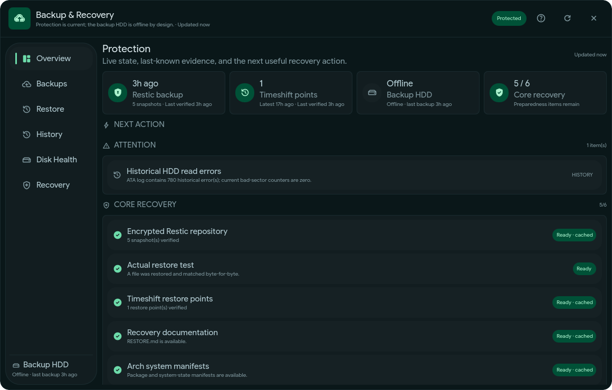
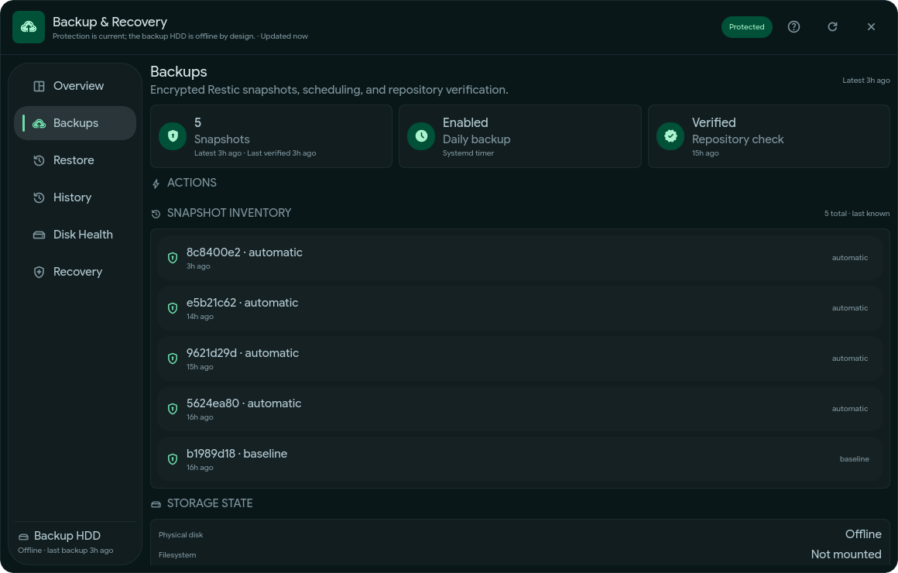
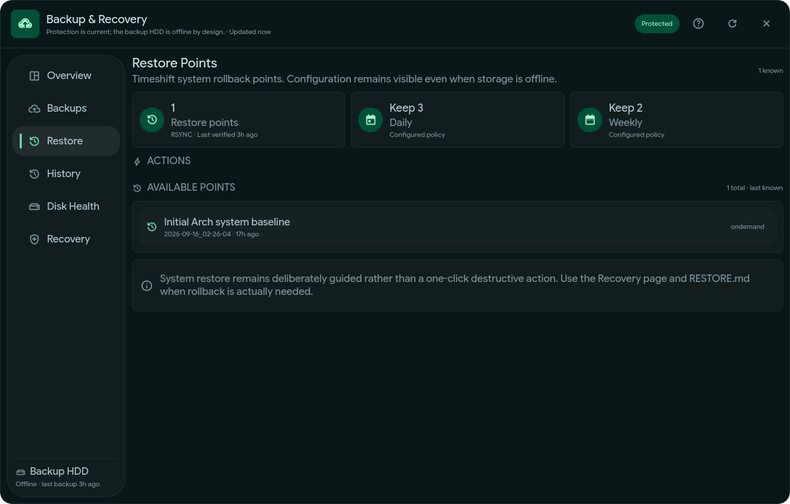
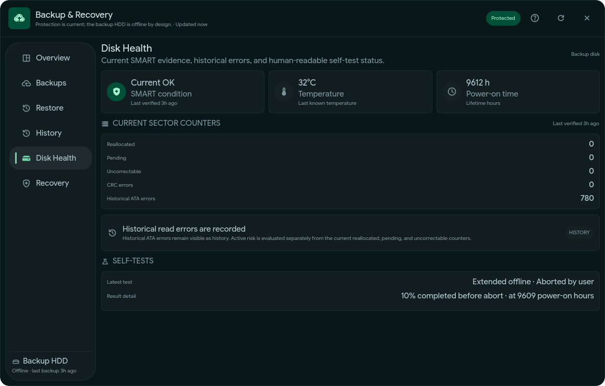
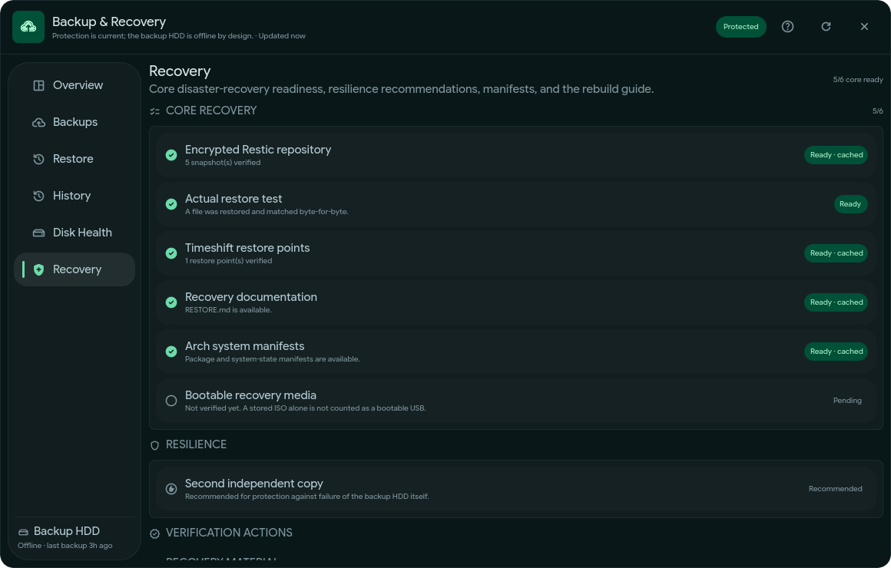

# Backup & Recovery Center

[](https://github.com/harkoussomar/backup-recovery-center/actions/workflows/verify.yml)

A Quickshell control center for an Arch Linux recovery stack built around
**Restic**, **Timeshift**, **SMART**, systemd, and narrowly scoped privileged
actions.

Backup & Recovery Center turns backup and recovery state into something that is
easy to inspect, verify, and act on without hiding important uncertainty.

> **Status:** `v0.1.0-alpha.6`
>
> This is an early portability and hardening build. The source, backend safety
> tests, installer contract, and Bubblewrap sandbox audit pass, but a fresh
> clean-Arch VM installation test is still pending before the first tagged
> public prerelease.

## Overview



The dashboard separates:

- live state from cached evidence;
- connected from mounted storage;
- backup success from actual restore verification;
- historical disk errors from current SMART risk;
- recovery readiness from recommendations that are still pending.

## Screenshots

### Backups

Encrypted Restic snapshots, backup scheduling, repository verification, and
storage state.



### Restore points

Timeshift RSYNC rollback points and retention policy without exposing a
one-click destructive system restore.



### Disk health

Current SMART state, temperature, lifetime power-on hours, sector counters,
historical ATA errors, and self-test status.



### Recovery readiness

A concrete disaster-recovery checklist covering Restic, restore testing,
Timeshift, recovery documentation, system manifests, and bootable media.



## Validation status

| Area | Status |
|  --- | --- |
| Public-tree sanitization | ✅ Passing |
| Python compilation | ✅ Passing |
| Shell syntax | ✅ Passing |
| Backend safety regressions | ✅ Passing |
| Quickshell shell-editor integration | ✅ Passing |
| Public contract tests | ✅ Passing |
| Bubblewrap zero-network installer audit | ✅ Passing |
| GitHub Actions CI | ✅ Passing |
| Live personal deployment/backend actions | ✅ Validated separately |
| Fresh clean-Arch VM installation | ⏳ Pending |

The Bubblewrap test uses an isolated synthetic Arch/Illogical-Impulse
environment. It does not modify the host backup configuration.

## Why this project exists

Backup tools often expose raw commands but make it surprisingly difficult to
answer basic operational questions:

- Is my backup disk connected?
- Is it mounted?
- Is the filesystem actually the disk I expect?
- Is the Restic repository accessible?
- Is `0 snapshots` real, or is the repository simply offline?
- When was the repository last checked?
- Has a real file actually been restored and byte-compared?
- Are SMART errors current or only historical?
- Is it safe to unmount the disk?
- If the machine fails today, what recovery pieces are still missing?

Backup & Recovery Center turns those questions into explicit states and fixed
actions.

## Design invariants

The project deliberately follows several safety rules.

- **Unknown is not zero.**
- **Offline is not broken.**
- **Connected is not the same as mounted.**
- **A readable mount is not trusted until its filesystem UUID matches.**
- **Live state and last-known verified evidence are separate.**
- **Backup success is not restore proof.**
- **Historical SMART errors are not presented as current sector failure.**
- **The GUI never receives an arbitrary root shell.**
- **Privileged operations are fixed and allow-listed.**
- **Safe eject refuses active backup/check work and an in-progress SMART
  self-test.**
- **System restore remains guided rather than becoming a one-click destructive
  operation.**

## Current target

This alpha currently targets:

- Arch Linux
- Hyprland
- Quickshell
- end-4/dots-hyprland / Illogical Impulse shell architecture
- Restic
- Timeshift **RSYNC** mode
- smartmontools
- systemd
- Polkit

It is **not** a general Linux backup installer.

The current public alpha controls an **existing Restic + Timeshift setup** and
adds state collection, verification, fixed privileged actions, recovery
readiness, and a Quickshell interface around it.

## What it manages

Backup & Recovery Center currently understands these recovery layers:

```text
┌───────────────────────────────────────────────┐
│              Backup & Recovery               	│
├───────────────────────────────────────────────┤
│ Restic        encrypted/versioned file backup	│
│ Timeshift     system rollback points          │
│ SMART         physical backup-disk health     │
│ systemd       scheduled + privileged actions  │
│ Polkit        narrow privilege boundary       │
│ manifests     installed/system state evidence │
│ recovery docs disaster-recovery instructions 	│
└───────────────────────────────────────────────┘
